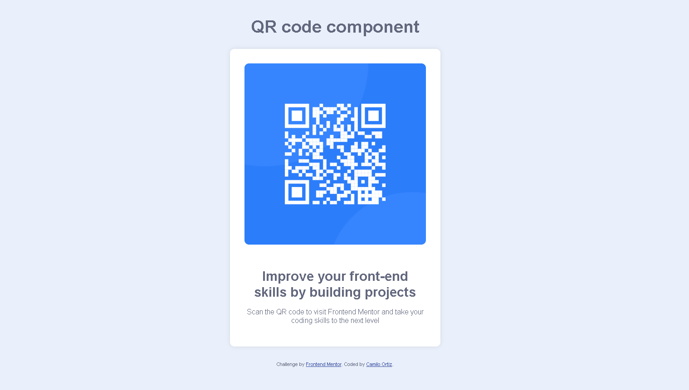

# Frontend Mentor - QR Code Component Solution

This is a solution to the [QR Code Component Challenge in Frontend Mentor](https://www.frontendmentor.io/challenges/qr-code-component-iux_sIO_H). Frontend Mentor challenges help you improve your programming skills by building realistic projects.

## Table of Contents

- Summary](#summary)
  - Screenshot](#screenshot)
  - Links](#links)
- My process](#my-process)
  - Built-with](#built-with)
  - Useful resources](#useful-resources)
- Author](#author)

## Abstract

QR code component project using semantic HTML and CSS. A simple approach to generating QR codes on the web.

### Screenshot

### Links

- Solution URL: (https://github.com/camilortizdev/QR-code-component.git)
- Live site URL: (https://your-live-site-url.com)

### My process

### Built with

- Semantic HTML5
- Custom CSS properties
- Flexbox

### What I learned

perseverance is key to achieving your goals. No matter how long it takes, keep going.

## Author

- Website - [Camilo Ortiz](https://www.camilortiz.dev)
- Frontend Mentor - [@camilortizdev](https://www.frontendmentor.io/profile/camilortizdev)
- GitHub - [@camilortizdev](https://github.com/camilortizdev)
